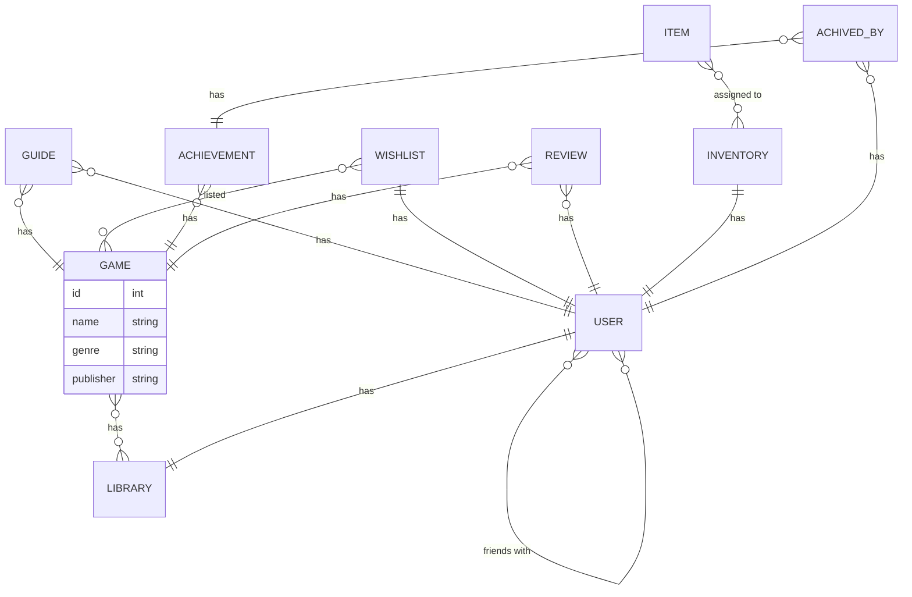

```mermaid
erDiagram
    GAME o{--o{ LIBRARY : has
       GAME {
        id int
        name string
        genre string
        publisher string
    }
    GUIDE }o--|| GAME : has
    WISHLIST }o--o{ GAME : listed
    ACHIEVEMENT }o--|| GAME : "has"
    REVIEW }o--|| GAME : has    

    GUIDE }o--|| USER : has
    WISHLIST ||--|| USER : has
    %%ACHIEVEMENT }o--o{ USER : "achieved"
    REVIEW }o--|| USER : has    
    INVENTORY ||--|| USER : has

    USER ||--|| LIBRARY : "has"
    USER }o--o{ USER : "friends with"    
    ITEM }o--o{ INVENTORY : "assigned to"

    ACHIVED_BY }o--|| USER : has
    ACHIVED_BY }o--|| ACHIEVEMENT: has
```
