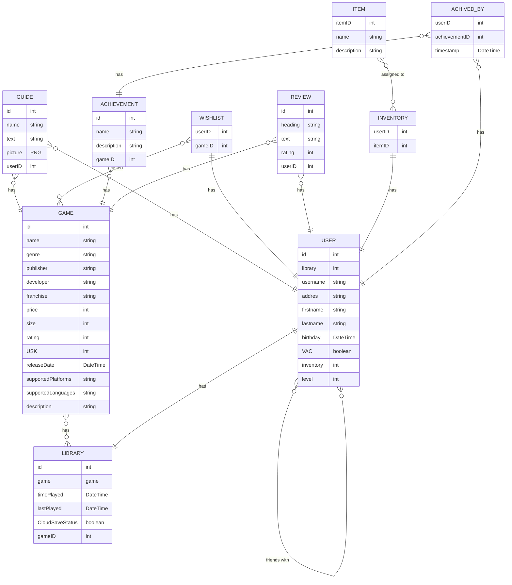

# Report Steam

## Report Title:

Filippo Fiorenza 205 194
Patrick Sandmann
Dennis Erbe

Semester: SS2023, Repo: Steam, Course ID: 262058, Course name: Datenbanken 1

## Introduction:

### Access Patterns

1. As a user, I would like to be able to create an account for myself
2. As a game developer, I want to be able to provide the updated version of my game software
3. As an admin, I should be able to delete the account of players who have repeatedly attracted attention by cheating in multiplayer games.
4. As a friend of another user, I would like to see what games he has in his library.
5. As a user, I would like to put the games I want on my wishlist
6. As a game developer, I would like to update the price of my offered games

## Data Model:

### Entity-Relationship Diagram

## Tooling:

## Lessons Learned:
