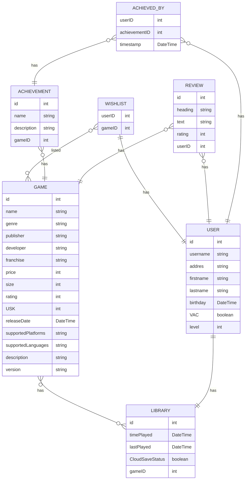

# Report Steam

## Report Title:

Filippo Fiorenza 205 194

Patrick Sandmann 214 063

Dennis Erbe 214 081

Semester: SS2023, Repo: Steam, Course ID: 262058, Course name: Datenbanken 1

## Introduction:

We modeled the popular video game digital distribution service Steam from Valve. Our application consists of the
following
entities: Game, User, Library, Wishlist, Achievement, Review.

The relationships of our entities are shown in the mermaid ER diagram below.

The Game entity in our application represents not a single unique instance of a uniquely bought key for a user
but the general game + information which can be bought by multiple users for example "The Elder Scrolls V: Skyrim" but
not the
unique key which can be redeemed in a user library. This is why we have only one unique game table entry for each game.

Reviews are the rating feature of Steam where each user can write feedback about a game. These reviews are always
assigned to
a single game and created by a single user.

Wishlists are lists which can be populated by the user with games that he would like to buy in the future and being
informed about
if they are on sale. A user always has exactly one wishlist and every wishlist is assigned to exactly one user.

Library contains games and for each game contained in the library the time played and so on is saved.

### Access Patterns

1. As a user, I would like to list all the games that I have in my library | read
2. As a game developer, I want to be able to provide the updated version of my game software | update
3. As an admin, I should be able to delete the account of players who have repeatedly attracted attention by cheating in
   multiplayer games. | delete
4. As a game developer, I would like to publish my new game on steam. | create
5. As a user, I would like to be able to add games on my wishlist and remove them | update
6. As a game developer, I would like to update the price of my offered games | update
7. As a user I would like to be able to unlock achievements | create
8. As a user I would like to delete my review | delete

## Data Model:

Most of our access patterns could be implemented by using django's access methods, so we did not need to write custom
functions, except for
releasing a new game where we also wanted to assign the achievements for the new game and the update of the game
version.All the other access patterns could be implemented using just the already available django methods, so we just wrote the implementation
inside the tests without declaring special methods for each, but they could simply be extracted from the test if needed.

We also created constraints for our database tables where we thought it would benefit out application. A possible example for this is that we added a 
check constraint so that each achievement in the achieved_by relation table must be unique for each user and achievement combinations, so that a single 
user can unlock the same achievement only once. 

One of the challenges was that we wanted to save the time played for each individual game as well as the timestamp when
the game was last played. We achieved this behaviour by creating a many-to-many relationship table "GamesInLibrary" with the
through keyword of the many-to-many relationship of Django.

We encountered the same problem with the Wishlist where we also had a many-to-many relationship but luckily no additional
fields.

Another problem was that we wanted to ensure that when we create a user it is ensured that a new wishlist and library are
always created. We solved this problem with Django's signals feature.

### Entity-Relationship Diagram

## Tooling:

For our implementation of the digital distribution service Steam, we chose the Django framework and SQLite3 as the
database engine.

For the creation of the database, we followed the official documentation of Django. The first step was to install Python
and Django. From here, we were able to create a project in order to create models, fixtures and tests.

https://docs.djangoproject.com/en/4.2/intro/install/

https://docs.djangoproject.com/en/4.2/topics/install/

## Lessons Learned:

We learned how to set up a database with Django and SQLite3, how to implement the models from our ER-diagram, how to
create the JSON file to get entries for our tests. And finally, how to set up tests in Django and test our
implementation.

After installing Python and Django, we found it quite easy to think about and implement the model and the respective
fixtures for our model from our ER-diagram.

Problems occurred with the achievements here, we noticed during implementation that each user is only allowed to receive
the achievement once. We solved the problem by creating a unique constraint with the name “unique_achievement_unlock”
for the fields “user” and “achievement”.
We had another problem when creating a .gitignore file. We pushed our IDE settings along with it, which caused issues
with the python interpreter and the Django support of the IDE when other team members had pulled the latest commit.

We were surprised how many standard methods there are in Django, which saved us a lot of effort in the implementation.
Furthermore, we were surprised that when we declared an entity as a ForeignKey, django automatically named the variable ID
for the entity, so we often had fields like gameID_id which we then had to fix.

## Video

