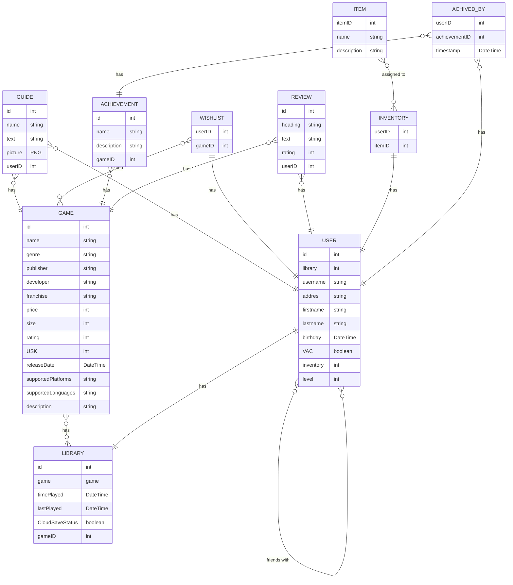

# Report Steam Database 1 SS2023
## Entity-Relationship Diagram

```mermaid
erDiagram
    GAME o{--o{ LIBRARY : has
        GAME {
        id int
        name string
        genre string
        publisher string
        developer string
        franchise string
        price int
        size int
        rating int
        USK int
        releaseDate DateTime
        supportedPlatforms string
        supportedLanguages string
        description string
    }
    LIBRARY {
        id int
        game game
        timePlayed DateTime
        lastPlayed DateTime
        CloudSaveStatus boolean
        gameID int
    }
    GUIDE }o--|| GAME : has
        GUIDE {
            id int
            name string
            text string
            picture PNG
            userID int
    }
    WISHLIST }o--o{ GAME : listed
        WISHLIST {
            userID int
            gameID int            
        }
    ACHIEVEMENT }o--|| GAME : "has"
        ACHIEVEMENT {
            id int
            name string
            description string
            gameID int
        }
    REVIEW }o--|| GAME : has    
        REVIEW {
            id int
            heading string
            text string
            rating int
            userID int
        }

    GUIDE }o--|| USER : has
    WISHLIST ||--|| USER : has
    %%ACHIEVEMENT }o--o{ USER : "achieved"
    REVIEW }o--|| USER : has    
    INVENTORY ||--|| USER : has
        INVENTORY {
            userID int
            itemID int
        }

    USER ||--|| LIBRARY : "has"
        USER {
            id int
            library int
            username string
            addres string
            firstname string
            lastname string
            birthday DateTime
            VAC boolean
            inventory int
            level int
        }
    USER }o--o{ USER : "friends with"    
    ITEM }o--o{ INVENTORY : "assigned to"

    ACHIVED_BY }o--|| USER : has
        ACHIVED_BY {
            userID int
            achievementID int
            timestamp DateTime
        }
    ACHIVED_BY }o--|| ACHIEVEMENT: has
    ITEM {
        itemID int
        name string
        description string
    }
```
## Access Patterns
### created by Filippo Fiorenza, Patrick Sandmann, Dennis Erbe
